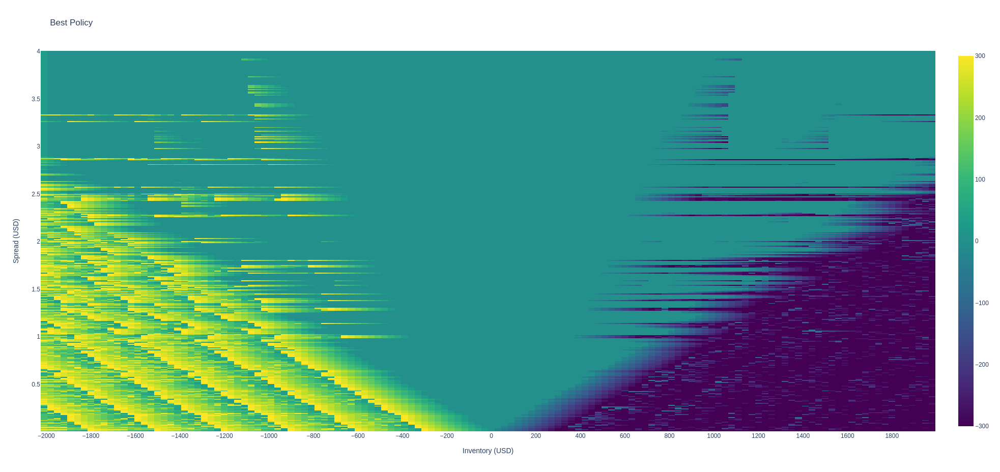
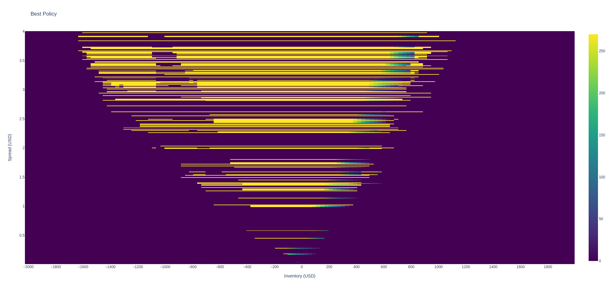
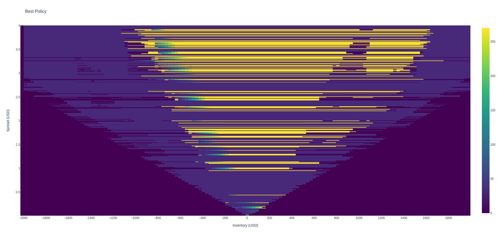
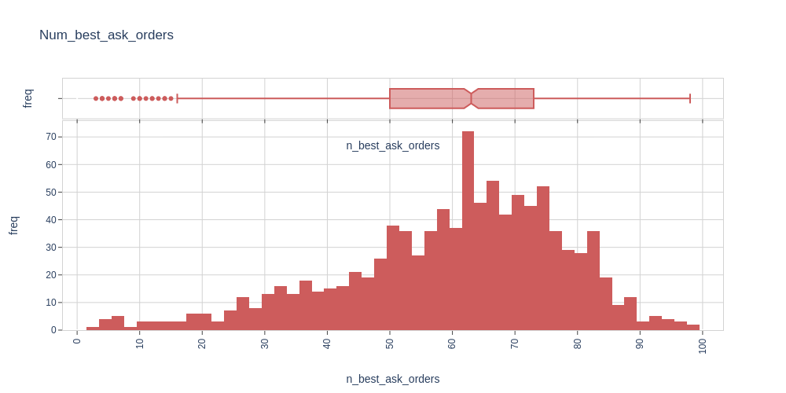
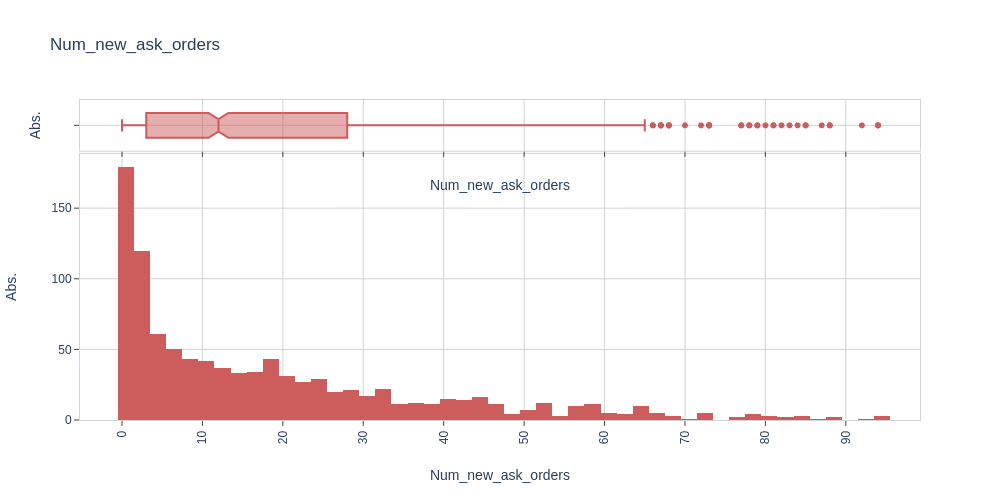
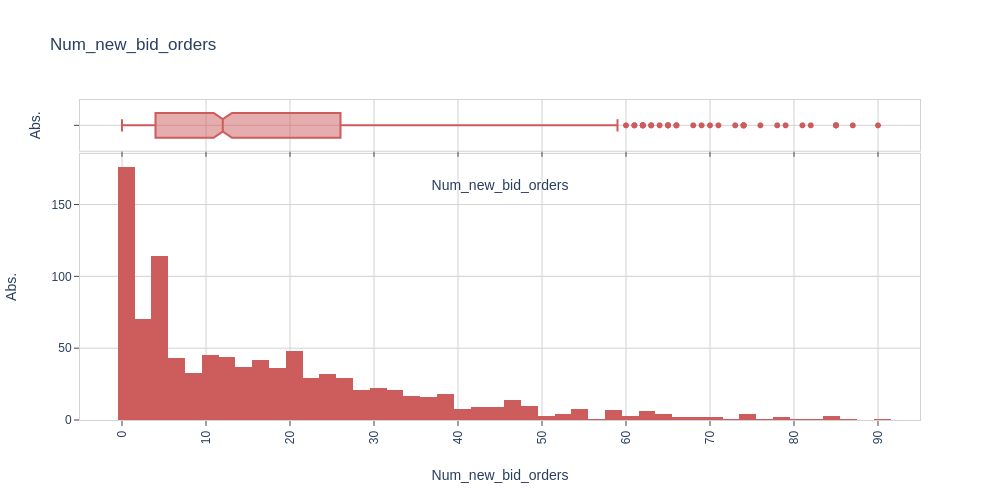
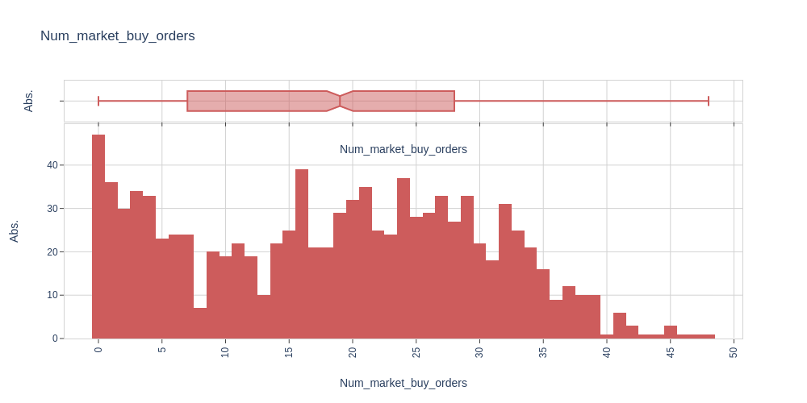
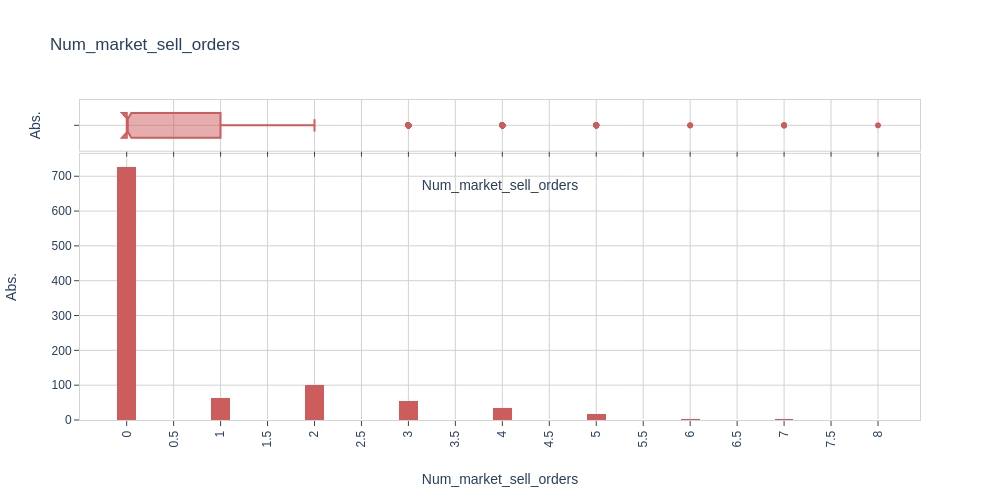
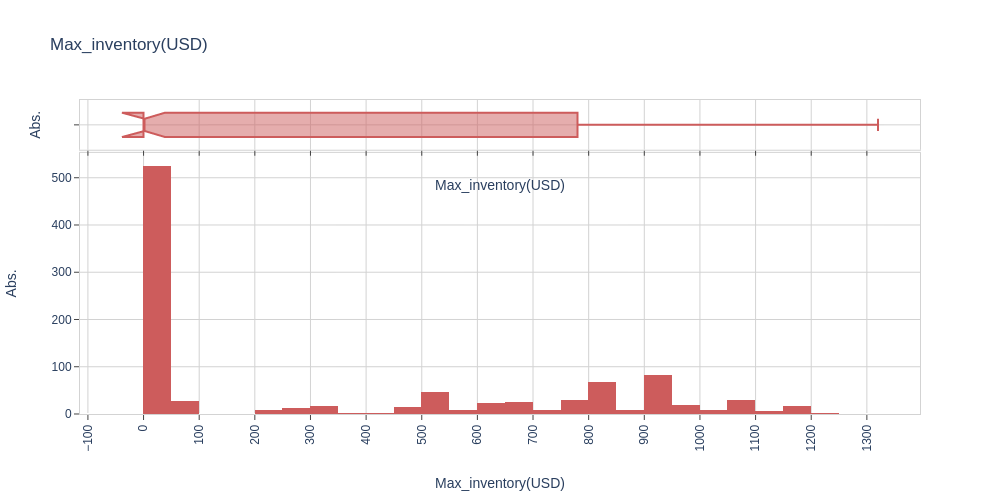
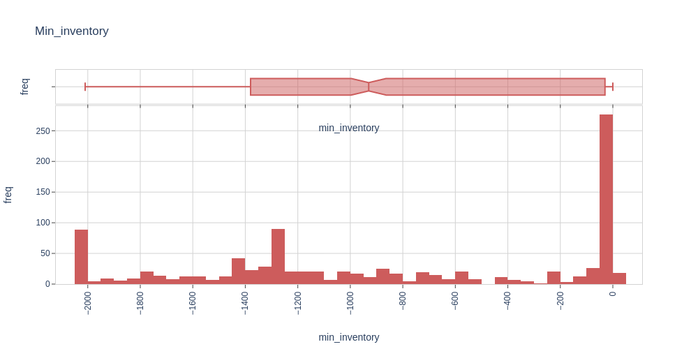

# high-frequency-trading
We propose a framework for studying optimal market-making policies in a limit order book

<html>
<head>
  
</head>
<body>
  
<h1>Input Data BTC-USD</h1>

The input data used for this specific case can be found here
<a href="https://bitdataset.com/historical-data/binance-usd-m-futures-top-of-book-quotes-data/">Input data</a>   

  
<h1>Input Model Parameters</h1>
  
<table>
    <thead>
        <tr>
            <th>Name</th>
            <th>Value</th>
        </tr>
    </thead>
    <tbody>

      <tr><td>final wealth</td>    <td>333.71</td></tr>
      
    </tbody>
</table>

<h1>Best Policy Results</h1>
  
Market orders best policy (Take) -time=100s

  

Limit orders best policy - Bid -time=100s

  

Limit orders best policy - Ask -time=100s

  

  

  

  

  

  

  

  

  

  

 
<table>
    <thead>
        <tr>
            <th>Name</th>
            <th>Mean</th>
            <th>SD</th>
        </tr>
    </thead>
    <tbody>

<tr><td>final wealth</td>    <td>333.71</td>          <td>342.08</td></tr>
<tr><td>num_best_ask_orders</td>          <td>60.10</td>    <td>17.81</td></tr>
<tr><td>num_new_ask_orders</td>           <td>18.49</td>     <td>20.06</td></tr>
<tr><td>num_best_bid_orders</td>          <td>61.33</td>    <td>17.30</td></tr>
<tr><td>num_new_bid_orders</td>           <td>17.10</td>    <td>17.50</td></tr>
<tr><td>num_market_buy_orders</td>        <td>18.42</td>    <td>11.58</td></tr>
<tr><td>num_market_sell_orders</td>        <td>0.69</td>    <td>1.32</td></tr>
<tr><td>max_inventory</td>             <td>343.83</td>    <td>411.17</td></tr>
<tr><td>min_inventory</td>            <td>-857.19</td>    <td>705.33</td></tr> 
      
</tbody>
 </table>

<table>
    <tbody>
     <tr><td>Information ratio</td>    <td>0.97</td> 
  </tbody>
</table>

<h1>Contact</h1>

E-Mail Adresse: ste.penazzi1987@gmail.com  
<a href="https://www.linkedin.com/in/stefano-penazzi-datascientist/">LinkedIn</a>  

</body>
</html>
