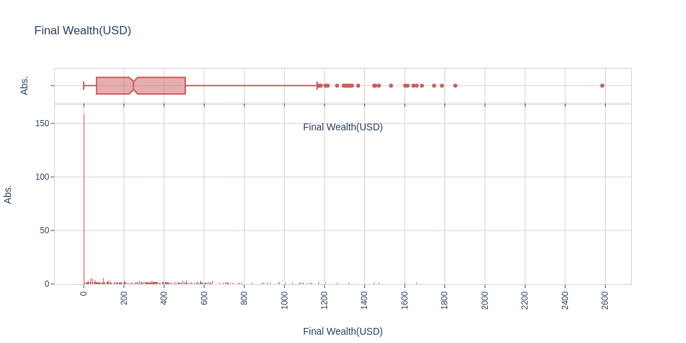
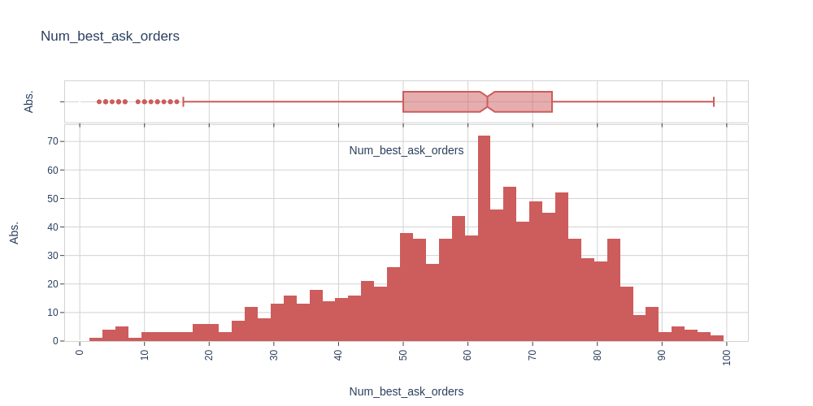

# high-frequency-trading
We propose a framework for studying optimal market-making policies in a limit order book

<html>
<head>
  
</head>
<body>
  
<h1>Input Data</h1>

The input data used for this specific case can be found here
<a href="https://bitdataset.com/historical-data/binance-usd-m-futures-top-of-book-quotes-data/">Input data</a>  

<h1>Best Policy Results</h1>
  
Market orders best policy (Take) -time=100s

  

Limit orders best policy - Bid -time=100s

  

Limit orders best policy - Ask -time=100s

  

  

  

  

  

  

  

  

  

  

  
<h0>Mean</h0>
final wealth             333.711092
n_best_ask_orders        60.107000
n_new_ask_orders         18.499000
n_best_bid_orders        61.331000
n_new_bid_orders         17.102000
n_market_buy_orders      18.421000
n_market_sell_orders      0.691000
max_inventory           343.830000
min_inventory          -857.190000

<h0>SD</h0>
final wealth             342.081583
n_best_ask_orders        17.818840
n_new_ask_orders         20.061916
n_best_bid_orders        17.304823
n_new_bid_orders         17.509145
n_market_buy_orders      11.588877
n_market_sell_orders      1.325623
max_inventory           411.171123
min_inventory           705.335312 
 

<h1>Contact</h1>

E-Mail Adresse: ste.penazzi1987@gmail.com  
<a href="https://www.linkedin.com/in/stefano-penazzi-datascientist/">LinkedIn</a>  

</body>
</html>
