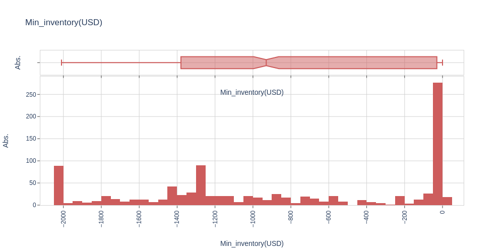

# high-frequency-trading
We propose a framework for studying optimal market-making policies in a limit order book

<html>
<head>
  
</head>
<body>
  
<h1>Input Data</h1>

The input data used for this specific case can be found here
<a href="https://bitdataset.com/historical-data/binance-usd-m-futures-top-of-book-quotes-data/">Input data</a>  

<h1>Best Policy Results</h1>
  
Market orders best policy (Take) -time=100s

  

Limit orders best policy - Bid -time=100s

  

Limit orders best policy - Ask -time=100s

  

  

  

  

  

  

  

  

  

  

 
<table>
    <thead>
        <tr>
            <th>Name</th>
            <th>Mean</th>
            <th>SD</th>
        </tr>
    </thead>
    <tbody>

<tr><td>final wealth</td>    <td>333.711092</td>          <td>342.081583</td></tr>
<tr><td>num_best_ask_orders</td>          <td>60.107000</td>    <td>17.818840</td></tr>
<tr><td>num_new_ask_orders</td>           <td>18.499000</td>     <td>20.061916</td></tr>
<tr><td>num_best_bid_orders</td>          <td>61.331000</td>    <td>17.304823</td></tr>
<tr><td>num_new_bid_orders</td>           <td>17.102000</td>    <td>17.509145</td></tr>
<tr><td>num_market_buy_orders</td>        <td>18.421000</td>    <td>11.588877</td></tr>
<tr><td>num_market_sell_orders</td>        <td>0.691000</td>    <td>1.325623</td></tr>
<tr><td>max_inventory</td>             <td>343.830000</td>    <td>411.171123</td></tr>
<tr><td>min_inventory</td>            <td>-857.190000</td>    <td>705.335312</td></tr> 
      
</tbody>
 </table>

 

<h1>Contact</h1>

E-Mail Adresse: ste.penazzi1987@gmail.com  
<a href="https://www.linkedin.com/in/stefano-penazzi-datascientist/">LinkedIn</a>  

</body>
</html>
