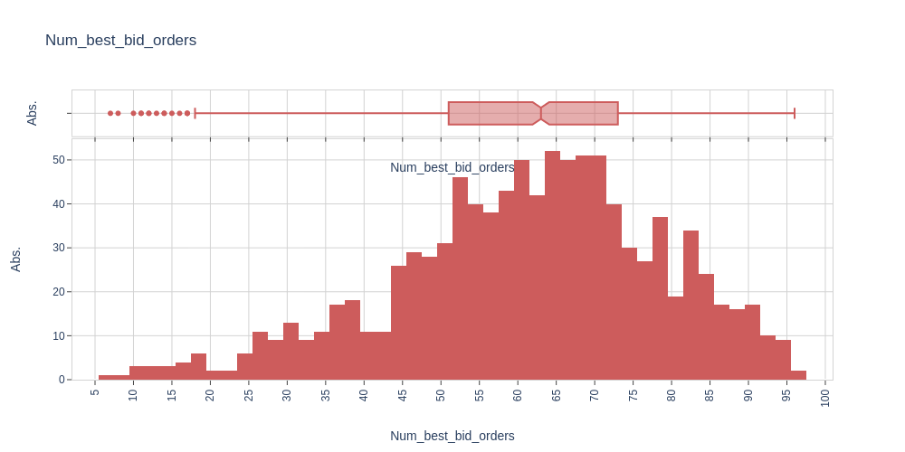

# high-frequency-trading
We propose a framework for studying optimal market-making policies in a limit order book

<html>
<head>
  
</head>
<body>

  

  

  

  

  

  

  

  

  

  

  

  

</body>
</html>
